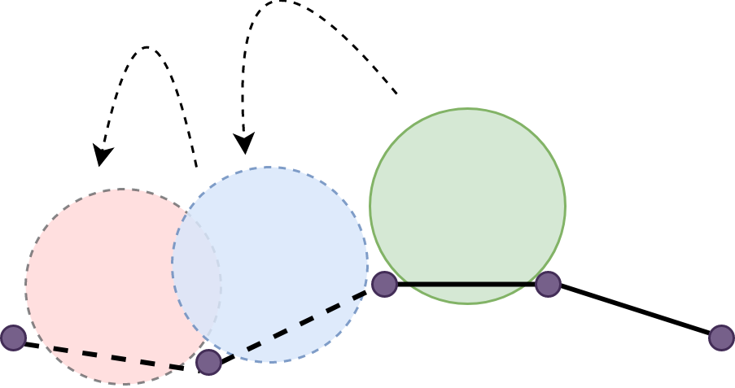
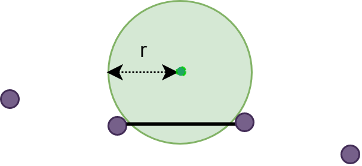
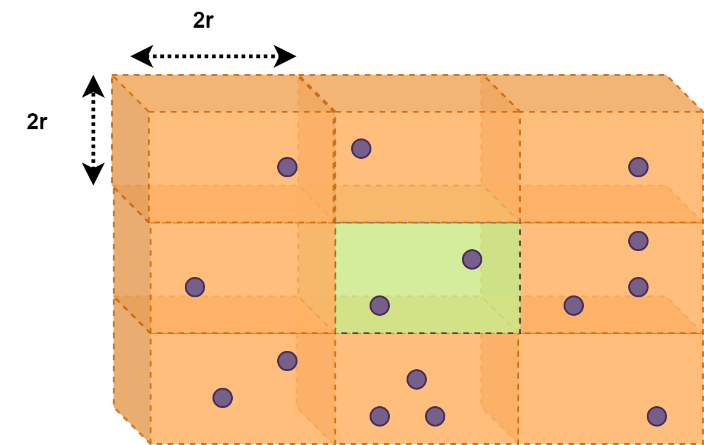
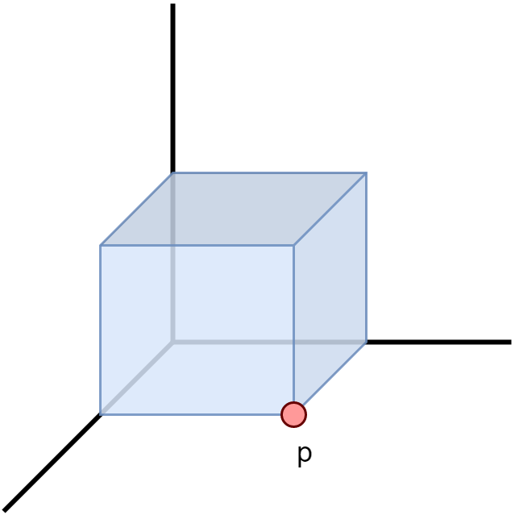
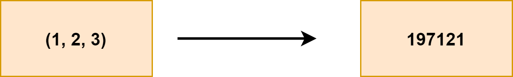
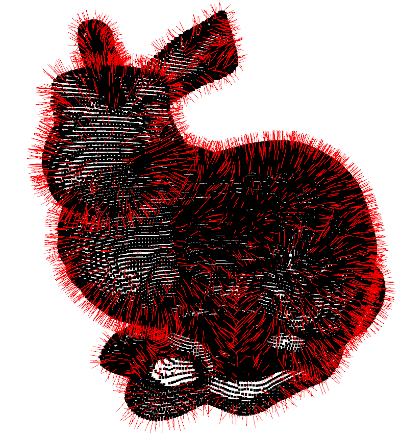
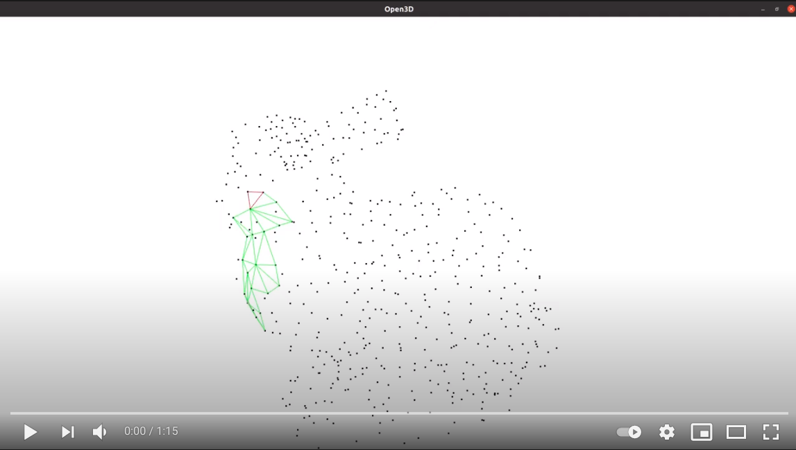
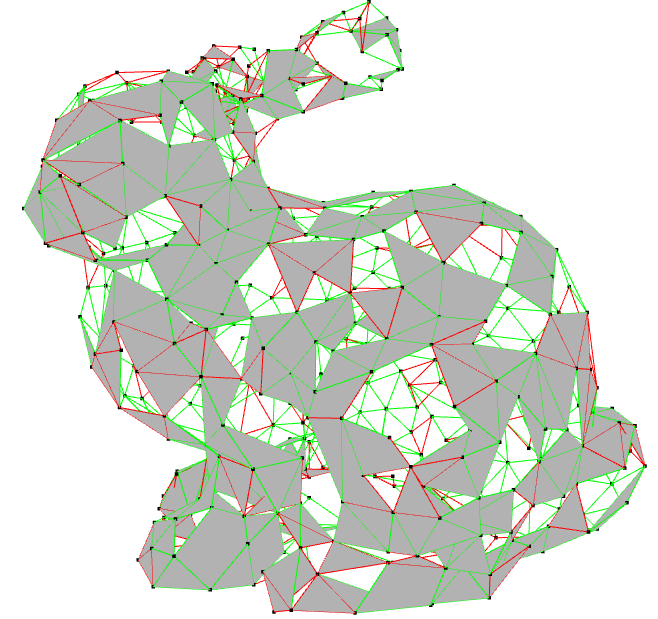
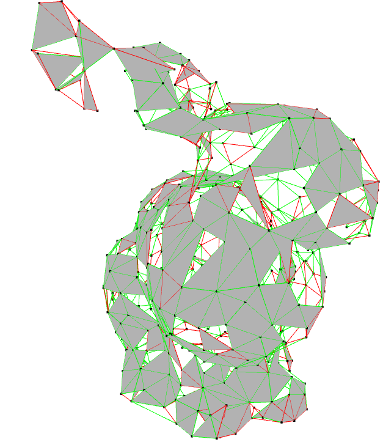
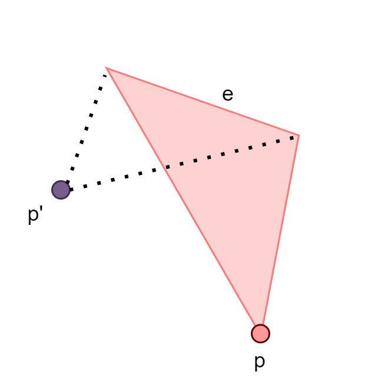

# Ball-Pivoting-Algorithm
Python implementation of the ball-pivoting algorithm (BPA), which was published in 1999 by Bernardini  [[1]](#1). Some ideas in
this implementation were inspired by the implementation of Digne, which was published in 2014 [[2]](#2).
<p align="center">
  
</p>

## Algorithm Overview
This algorithm solves the problem of reconstructing mesh surface from a 3D point cloud. The main assumption this algorithm is
based on is the following: Given three vertices, and a ball of radius `r`, the three vertices form a triangle if the ball is getting "caught" and settle 
between the points, without containing any other point.

The algorithm stimulates a virtual ball of radius `r`. Each iteration consists of two steps:
- **Seed triangle** - The ball rolls over the point cloud until it gets "caught" between three vertices and settles between in them. 
Choosing the right `r` promises no other point is contained in the formed triangle. This triangle is called "Seed triangle".
- **Expanding triangle** - The ball pivots from each edge in the seed triangle, looking for a third point. It pivots until it gets
"caught" in the triangle formed by the edge and the third point. A new triangle is formed, and the algorithm
tries to expand from it. This process continues until the ball can't find any point to expand to.
  
At this point, the algorithm looks for a new seed triangle, and the process described above starts all over.

The following figures demonstrates those two steps. 

<p align="center">
  
</p>

<p align="center">2D view of the finding seed triangle step</p>

<p align="center">
  
</p>

<p align="center">2D view of the expanding triangle step</p>

Two vague assumptions that are necessary for the algorithm are that the point cloud is "dense enough", and that the
chosen `r` size is "slightly" larger than the average space between points. I couldn't find a metric method to evaluate
those two variables at the moment, and more work needs to be done on this.
  

## Data Structures
### Grid
I used a virtual 3D grid in which in each cell of the grid, all points are at distance of maximum `2r` from all 
other points. With this method, i am able to limit the number of points i need to search. Since we are looking to fit a
ball of radius `r` between three points, we can be assured that if the distance be two points is larger than `2r`, the ball
won't get caught between them. Therefore, while checking all possible points to pivot from a point `p` when generating 
seed triangle or expanding triangle, i need to check `p`'s cell, and all 8 cells that touches this cell. Note that there
might get points that are `4r` apart, and i have to check that when iterating through these neighbor points. Example for that
is shown in the following figure. 

<p align="center">
  
</p>

<p align="center">2D view on part of the grid. The orange cells are the neighbors of the green cell</p>

Each cell is represented by a single point. For example, all cells are represented by the point marked by `p`:
<p align="center">
  
</p>

Each cells saves the entire points contained in it, but i also needed each point to save which cell it belongs to, to avoid 
iterating all the grid when searching for a point. I decided that each point will save the cell in belongs to. In order to 
decrease the memory required for this cyclic-design, each point save encoded unique version of the cell it belongs to. The encoding
was done by shifting and concatenating the coordinates of the point that defines the cell.

<p align="center">
  
</p>

<p align="center">Encodeing the cell define by (1, 2, 3) to 197121</p>


### Point
Consists of 3 coordinates, the normal in this point, the cell node it's sitting in, according to the grid's initiation.

### Edge
Consists of 2 Point objects.

## Multithreading
Initially i implemented a multi-threaded version of the algorithm. I knew it won't improve the algorithm's running time due to Python's GIL, that prevents
making use of more than one CPU core to run threads in parallel, but i thought it might improve the algorithm's mesh quality if i run simultaneously multiple threads in different parts of the object. It didn't improved the algorithm's quality. I think a better idea would be the implement the algorithm using CUDA and [Numba](http://numba.pydata.org/)'s JIT, but it's not trivial and requires some work.

## Complexity
Finding a seed costs  time. We iterate through all points.
For each point `p1`, i check in  time it's neighbor cells
in order to find all points that are at maximum  distance of `2r` from `p1`. I sort all neighbor points by distance from 
`p1` in   to make sure the formed triangles will be as small as possible to reduce the number of cases where a
point in contained inside the formed triangle. For each point `p2` in `p1`'s neighbors, the same sorting process occurs. 
In order to check if a ball with radius of `r` can fit into the triangle defined by `p1`, `p2` and `p3`, i calculate the
radius of the inner-circle of that triangle. This calculation is in  
. If the normal of this triangle is in the same direction as the point's normal, the triangle is added to the mesh.
This check is also in  . 

Expanding a single triangle costs  . 
For each of the triangle's edges `e=(p1,p2)`, i check in  
time the neighbor cells of `p1` and `p2` in order to find all points that are at maximum distance of `2r` from `p1` and `p2`.
I sort the points as before, in  .
I then check if the ball can fit into the formed triangle, and that it's normal vector is in the same
direction as the points.

At the worst case, the algorithm fails to expand the triangle everytime and has to find a new seed, making the total
run time complexity  . This scenario is unlikely.
I ignore in this section the time required for visualization.

## Visualizer
I've created a visualizer for the algorithm using the open-source library Open3D [[3]](#3). The visualizer updates it's rendering 
after a seed triangle is found, or an expanding triangle is found. An example of the visualizer is shown in the examples section.
I've also added normal visualization for debugging the data generation. An example for that is shown in the
following figure. 

<p align="center">
  
</p>

<p align="center">Stansford's bunny with normals</p>


## Dataset
This algorithm expects to get as input `.txt` file in the following pattern:
> x y z nx ny nz
> 
Where `x`, `y` and `z` are the point's coordinates, and `nx`, `ny` and `nz` are the point's normal vector's coordinates.
In order to generate the data to test the algorithm, i've downloaded 3D objects in .obj format [[4]](#4), extracted the points, and 
extracted each point's normal based on one of the facets it belongs to. Examples of the data are in the `data` folder. Code for generating new data is in `data_generator.py`.

## How to Run
### Requirements
- Python>=3.7
- open3d>=0.7.0.0
- numpy>=1.20.1

### Available Functions
- **create_mesh()**: Takes an optional argument `limit_iterations`, that limits the number of iterations of the algorithm. Generates 
a mesh. Must be called after initializing the BPA object.
  
    Example:
    ```python
    from bpa import BPA
    
    bpa = BPA(path='bunny_with_normals.txt', radius=0.005, visualizer=True)
    bpa.create_mesh(limit_iterations=1000)
    ```
- **visualizer.draw_with_normals()**: Takes an optional argument `percentage` that limits the number of points that their normal
will be drawn. If set to 100, all normals will be drawn. Default value is set to 10. Another argument is `normals_size` that defines the drawn normal's size. 
  Default value is set to 1.
  
    Example:
    ```python
    from bpa import BPA
    
    bpa = BPA(path='bunny_with_normals.txt', radius=0.005, visualizer=True)
    bpa.visualizer.draw_with_normals(percentage=20, normals_size=2)
    ```

## Example
An example of Stansford's bunny is in [here](https://www.youtube.com/watch?v=M7yjUFE5mTI):

<p align="center">
  <a href="https://www.youtube.com/watch?v=M7yjUFE5mTI">
    
   </a>
</p>


<p align="center">
  
</p>

<p align="center">
  
</p>

Red triangles are seed triangles, and green triangles are expanding triangles.

## Known Issues & TODOs
- Holes! - As you can see in the example, the algorithm fails to reach a full mesh, and many "holes" are left.
- Overlapping triangles - I have reduced the number of overlapping expanding triangles by checking that the third
  point we expand to is not in same side of the edge as the third point of the triangle we expand. For example, suppose we are
  expanding the orange triangle:
  <p align="center">
    
  </p>
  
  `e` is the edge we pivot on. Suppose these are the algorithm sees the point `p'`.
  I make sure the it won't pick it since `p'` in the same side of `e` as `p`. This does not apply to the seed
  triangles. I couldn't think of a way to identify those overlapping cases at the moment.
- Triangles vertices are not saved in clock-wise order, which makes it difficult later in exporting the mesh as `.obj` file.
- Generate `.obj` file out of the result mesh.
- Find a criteria for choosing the initial radius.
- Pre-check if the point cloud is "dense enough".
- Find a metric to evaluate how well the constructed mesh is.
- Implement cuda support.

## References
<a id="1">[1]</a>  [The Ball-Pivoting Algorithm for Surface Reconstruction](https://ieeexplore.ieee.org/stamp/stamp.jsp?tp=&arnumber=817351), by F. Bernardini, J. Mittleman and H. Rushmeier, 1999.

<a id="2">[2]</a>  [An Analysis and Implementation of a Parallel Ball Pivoting
Algorithm](https://www.ipol.im/pub/art/2014/81/article.pdf), by J. Digne, 2014.

<a id="3">[3]</a>  [Open3D offical website](http://www.open3d.org/).

<a id="4">[4]</a>  [Collection of .obj files](https://github.com/alecjacobson/common-3d-test-models).
